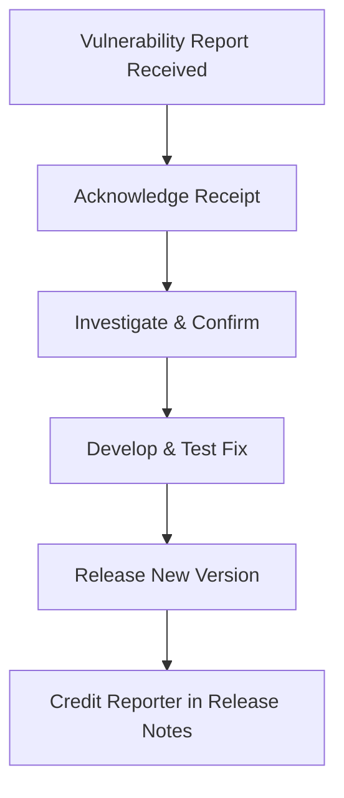

# Security Policy

## Reporting a Vulnerability

I take the security of this project seriously. If you believe you have found a security vulnerability, please report it
to me responsibly.

**Please do not report security vulnerabilities through public GitHub issues.**

Instead, please use the
[GitHub Private Vulnerability Reporting](https://docs.github.com/en/code-security/security-advisories/working-with-repository-security-advisories/configuring-private-vulnerability-reporting-for-a-repository)
feature through [Security Advisories](https://github.com/nikosavola/immich-wear/security/advisories), or
contact @nikosavola directly.

### What to include in a report

To help me understand and fix the issue, please include as much information as possible:

- A description of the vulnerability and its potential impact.
- Steps to reproduce the issue (a minimal working example is highly appreciated).
- Any potential mitigations you've identified.

### Process

## Known Dependabot alerts (build tooling only)

The open Dependabot alerts on this repo are all transitive dependencies of Gradle plugins (AGP,
ktlint) rather than app dependencies - none of them are on the compiled APK's classpath. Confirmed
via `./gradlew buildEnvironment` and `./gradlew :wear:dependencies --configuration ktlint`. GitHub
computes these from the repo's dependency graph, which its built-in Dependency graph /
"Automatic Dependency Submission" feature (Settings > Code security) resubmits on pushes to the
default branch - so alert counts only update after a change lands on `main`, not on this PR itself.

- **`org.jetbrains.kotlin:kotlin-gradle-plugin`** (GHSA-r937-wjx7-w2jp) - fixed in
  `2.4.20-Beta1`, but no stable `2.4.20` release exists yet. Shipping a pre-release Kotlin
  compiler isn't worth it for a build-cache-only issue; revisit once `2.4.20` is stable.
- **`ch.qos.logback:logback-core`** (6 alerts) - ktlint-cli pins `logback-classic` to the `1.3.x`
  branch even at its latest release (1.8.0, bumped from the ktlint-gradle-bundled 1.5.0 in
  `build.gradle.kts`). That bump moves the pinned version from 1.3.14 to 1.3.16, which should clear
  3 of the 6 alerts (the ones fixed below 1.3.15/1.3.16) once GitHub resubmits the dependency graph
  for `main`. The other 3 need `1.5.25`+, which no ktlint-cli release currently pulls.
- **Bouncy Castle (`bcprov-jdk18on`/`bcpkix-jdk18on`), `jose4j`, `jdom2`,
  `commons-lang3`, `httpclient`** - all bundled transitively by AGP 9.4.0's own SDK tooling
  (`sdklib`, `apkzlib`, `commons-compress`, etc.). AGP 9.4.0 was still the latest stable release as
  of 2026-09-04 (9.5.0 only had alpha builds); these will clear whenever Google ships a build-tools
  update that bumps them.
