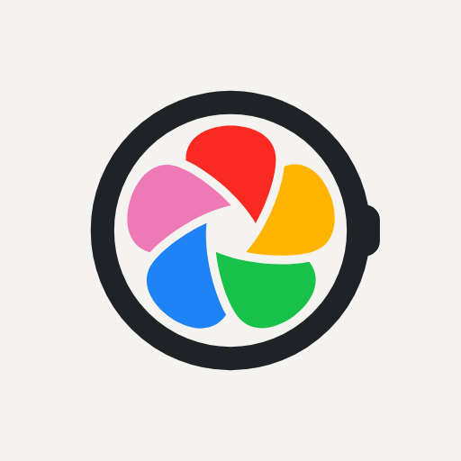

#  Immich Wear

[](https://github.com/nikosavola/immich-wear/actions/workflows/ci.yml)
[](LICENSE)

---

An unofficial [Immich](https://immich.app/) client for Wear OS. Browse your recent photos,
albums, favorites, and "on this day" memories, favorite an asset, and glance at a random photo
from a tile, all from your wrist. Not affiliated with or endorsed by the Immich project.

## Screenshots

_Coming soon - if you'd like to contribute a few, see [Contributing](#contributing) below._

## Requirements

- A Wear OS 3+ watch (Android API 30 or newer)
- A self-hosted [Immich](https://immich.app/) server you can reach from the watch, and an API
  key for it (**Account settings > API Keys** in the Immich web UI)

## Installation

Not yet published to the Play Store. Until then, build the `direct` flavor from source (see
[Contributing](#contributing)) and sideload it.

## Configuration

This app ships as two flavors with different sign-in flows:

- **`direct`** - type the server URL and API key directly on the watch. The straightforward
  option if you're building from source for yourself.
- **`playstore`** - the flavor intended for eventual Play Store distribution. Wear OS's Play
  Store guidelines discourage typing credentials on a watch, so this flavor hides that entry
  entirely: install the **Immich Wear Login** companion app on your phone, sign in there, and it
  pushes the server URL and API key to the watch over the Wear OS Data Layer.

Either way, sign-in happens exactly once - after that, the watch app works entirely on its own.

## Features

- Recent photos, albums, favorites, and today's memories, in a grid built for a round display
- Full-screen photo viewer with pinch/double-tap zoom and pan
- Swipe to reveal EXIF details and toggle favorite
- A tile showing a specific photo, a random one from an album, or nothing until you connect
- Phone companion app for credential-free setup on the watch (see [Configuration](#configuration))
- Dynamic color theming, following the system's Wear OS theme

## Known limitations

- **No offline access.** Every screen fetches from your server live; nothing is cached beyond
  what Coil keeps for already-viewed thumbnails.
- **Read-mostly.** You can favorite/unfavorite an asset, but there's no upload, delete, edit, or
  album management from the watch.
- **One account at a time.** Signing in replaces whatever was previously configured.

## Privacy

Your API key is encrypted at rest (AES/GCM via the Android Keystore) and never leaves the
watch except in requests to the Immich server address you configured. Nothing is collected,
logged, or sent anywhere by this app's developer.

## Contributing

This is a two-module Gradle project: `:wear` (the watch app, in `direct` and `playstore`
flavors) and `:mobile` (the phone companion, `playstore`-only in spirit). Development is driven
through [`just`](https://just.systems/) - see the [`justfile`](justfile) for every available
recipe (`just --list`), including:

```sh
just assemble            # build the direct-flavor debug APK
just assemble playstore  # ...or the playstore flavor
just test                # run the unit/Robolectric test suite
just verify              # lint + build both flavors + test, matching CI
just install             # build and install on a connected watch
just install playstore   # ...or install the playstore flavor
```

A release build needs a signing key - copy `keystore.properties.example` to
`keystore.properties` (gitignored) and fill in the four `RELEASE_*` properties, or set the
equivalent `RELEASE_STORE_*` environment variables. Without one, release builds fall back to
debug signing.

## Versioning

Version numbers follow [ZeroVer](https://0ver.org/): the major version stays at 0 indefinitely,
so a 0.y bump can carry breaking changes.

## License

[GNU Affero General Public License v3.0](LICENSE). The Immich name and logo are not covered by
this license - see [design/wearos-icon/NOTICE.md](design/wearos-icon/NOTICE.md) for how this
project's icon relates to Immich's own branding.
