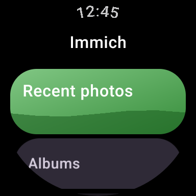
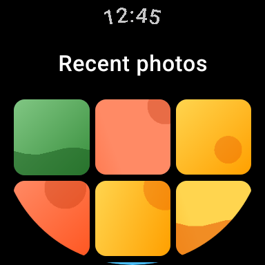
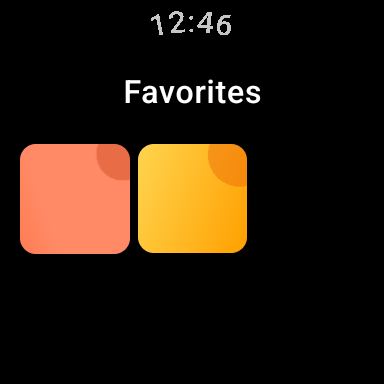

#  Immich Wear

[](https://github.com/nikosavola/immich-wear/actions/workflows/ci.yml)
[](LICENSE)

______________________________________________________________________

An unofficial [Immich](https://immich.app/) client for Wear OS. Browse your recent photos,
albums, favorites, and "on this day" memories, favorite an asset, and glance at a random photo
from a tile, all from your wrist. Not affiliated with or endorsed by the Immich project.

## Screenshots

<table>
  <tr>
    <td align="center"><br>Home</td>
    <td align="center"><br>Recent photos</td>
    <td align="center"><br>Photo viewer</td>
    <td align="center"><br>Favorites</td>
  </tr>
</table>

## Requirements

- A Wear OS 3+ watch (Android API 30 or newer)
- A self-hosted [Immich](https://immich.app/) server you can reach from the watch, and an API
  key for it (**Account settings > API Keys** in the Immich web UI)

## Installation

**Watch app:** grab the `direct`-flavor APK from the
[latest release](https://github.com/nikosavola/immich-wear/releases/latest) and sideload it with
`adb install`.

**Phone companion app** (optional, but recommended - see [Configuration](#configuration) below):
same release page, `mobile-debug.apk`.

Or build both yourself:

```bash
git clone https://github.com/nikosavola/immich-wear.git
cd immich-wear
just assemble                    # watch app (direct flavor)
just install                     # build and install it on a connected watch
./gradlew :mobile:assembleDebug  # phone companion app
adb install mobile/build/outputs/apk/debug/mobile-debug.apk
```

See [CONTRIBUTING.md](.github/CONTRIBUTING.md) for the full development setup.

## Configuration

This app ships as two flavors with different sign-in flows:

- **`direct`** - type the server URL and API key directly on the watch. The straightforward
  option if you're building from source for yourself.
- **`playstore`** - the flavor intended for eventual Play Store distribution. Wear OS's Play
  Store guidelines discourage typing credentials on a watch, so this flavor hides that entry
  entirely: install the **Immich Wear Login** companion app on your phone, sign in there, and it
  pushes the server URL and API key to the watch over the Wear OS Data Layer.

Either way, sign-in happens exactly once - after that, the watch app works entirely on its own.

## Features

- Recent photos, albums, favorites, and today's memories, in a grid built for a round display
- Full-screen photo viewer with pinch/double-tap zoom and pan
- Swipe to reveal EXIF details and toggle favorite
- A tile showing a specific photo, a random one from an album, or nothing until you connect
- Phone companion app for credential-free setup on the watch (see [Configuration](#configuration))
- Dynamic color theming, following the system's Wear OS theme

## Privacy

Your API key is encrypted at rest (AES/GCM via the Android Keystore) and never leaves the
watch except in requests to the Immich server address you configured. Nothing is collected,
logged, or sent anywhere by this app's developer.

## Contributing

See [CONTRIBUTING.md](.github/CONTRIBUTING.md) for development setup and guidelines, and
[CODE_OF_CONDUCT.md](.github/CODE_OF_CONDUCT.md) for community expectations. Found a security
issue? See [SECURITY.md](.github/SECURITY.md) instead of opening a public issue.

## Versioning

Version numbers follow [ZeroVer](https://0ver.org/): the major version stays at 0 indefinitely,
so a 0.y bump can carry breaking changes.

## License

[GNU Affero General Public License v3.0](LICENSE). The Immich name and logo are not covered by
this license - see [design/wearos-icon/NOTICE.md](design/wearos-icon/NOTICE.md) for how this
project's icon relates to Immich's own branding.
